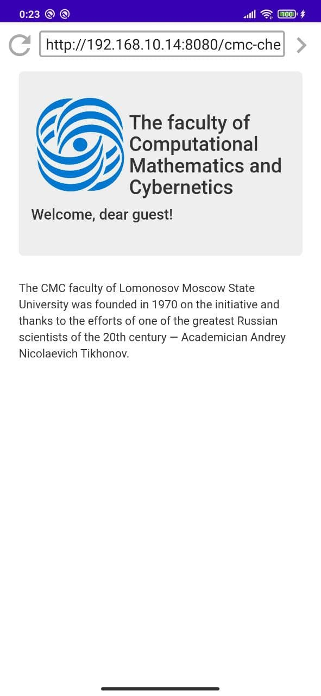
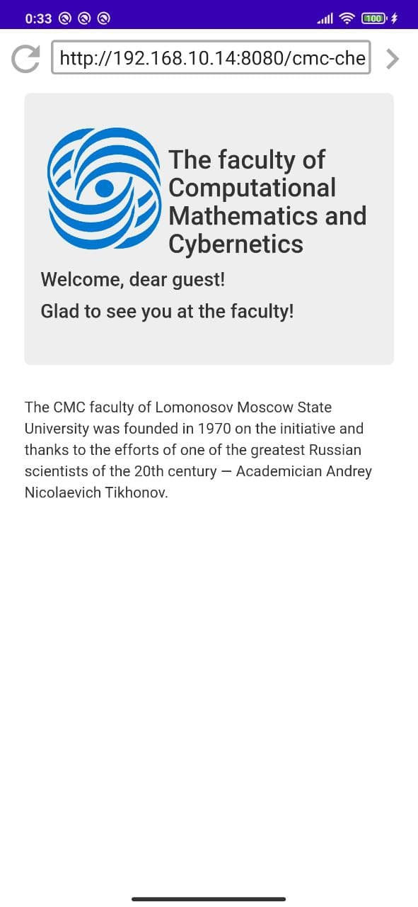
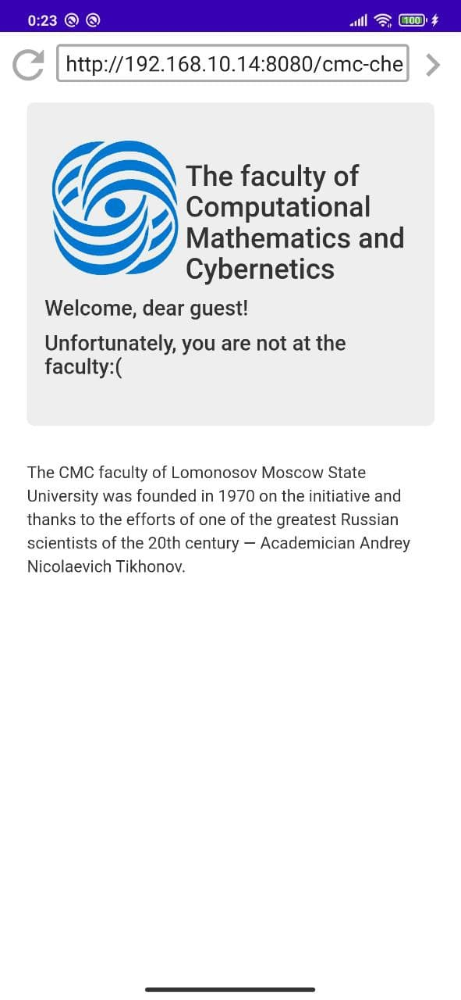

# Faculty CMC checker

Web-приложение “Faculty CMC checker” предназначено для запуска в Android приложении [Physical browser](https://github.com/Anna-Sl/physical-browser-advanced)
и демонстрирует _Javascript_ API [physical-browser-api](https://github.com/Anna-Sl/physical-browser-api).

Основная задача приложения - отобразить приветственную страницу факультета ВМК
и вызвать метод _startScanForAvailableWiFis_ класса _physical-browser-api_ - _PhysicalBrowserWifiChecker_. 
Через некоторое время приложение Physical browser асинхронно передаст информацию о видимых устройству Wi-Fi сетях обратно 
классу PhysicalBrowserWifiChecker.  

И сайт “Faculty CMC checker” отобразит одно из следующих сообщений в зависимости оттого, 
будет ли видна устройству Wi-Fi-сеть ВМК или нет.

(Сети, видимость которых проверяется приложением, расположены в файле [constants.js](./constants.js))

* 'Glad to see you at the faculty!';
* ‘Unfortunately, you are not at the faculty:(‘

  
  
  

Один из способов запустить сервер web-приложения “Faculty CMC checker” на Windows.

1) Необходимы Tomcat и Java JDK.
2) Прописать в переменных среды в JAVA_HOME путь к Java JDK.
3) Скопировать основные файлы текущего проекта (кроме .idea, cmc-checker.iml) в директорию “path_to_tomcat\tomcat\webapps”.
4) В cmd запустить из директории “path_to_tomcat\tomcat\bin” команду “startup”.
5) Проверить что работает: открыть в браузере страницу “localhost8080\cmc-checker”.

Еще один способ - через Idea Ultimate. Также необходимы Tomcat и Java JDK.
