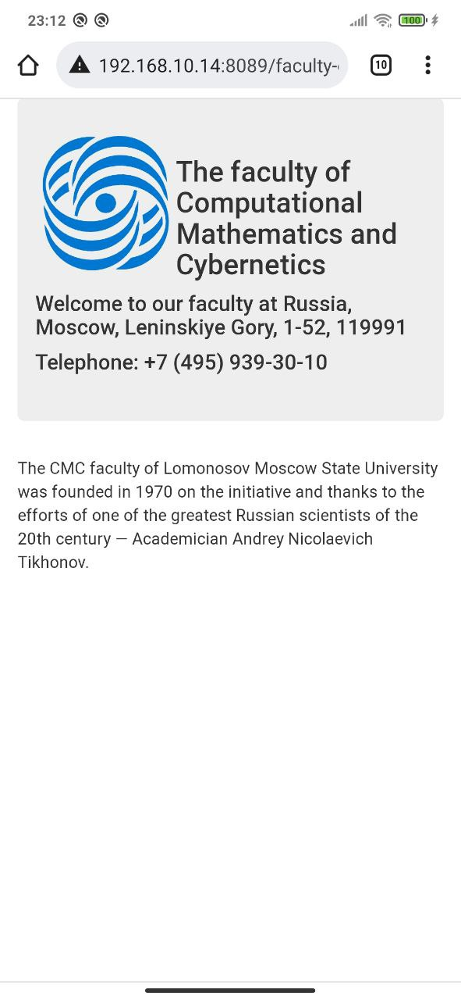
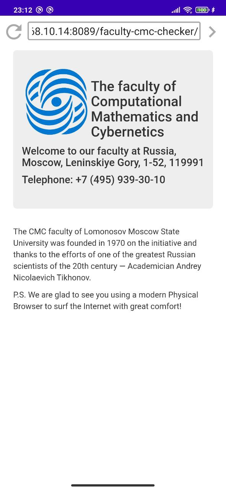
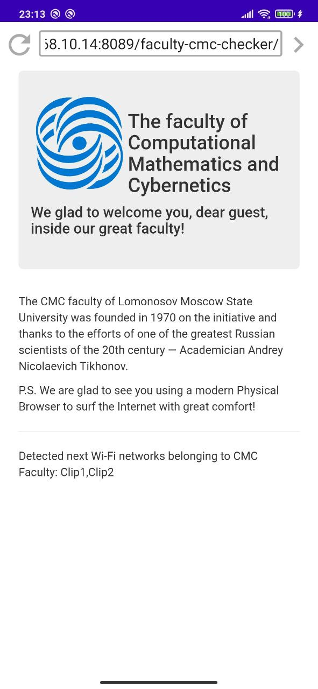

# Faculty CMC checker

Web-приложение “Faculty CMC checker” предназначено для запуска в Android приложении [Physical browser](https://github.com/Anna-Sl/physical-browser-advanced)
и демонстрирует _Javascript_ API [physical-browser-api](https://github.com/Anna-Sl/physical-browser-api).

Основная задача приложения - отобразить приветственную страницу факультета ВМК
и предоставить реализацию метода _openedInPhysicalBrowser_ на каждой из загружаемой страницы: 
_index.html_ или _inside-cmc-faculty.html_. 
При каждой загрузке страницы метод _openedInPhysicalBrowser_ вызывается Android приложением _Physical_ _browser_. 
В метод передается строка-параметр, отображающая данные по Wi-Fi и Bluetooth сетям.

Особенность такого подхода от предыдущего (который может быть найден в ветке текущего проекта _alternative-solution/cmc-checker-uses-AndroidInterface-instead-callback-from-browser_)
заключается в том, что разработчику Web-приложения предоставляется возможность сконцентрироваться на реализации своего проекта в большей степени чем ранее.
Вызов метода _openedInPhysicalBrowser_ Android приложением _Physical_ _browser_ осуществляется сразу,
как только готовы данные по сетям и страница окончательная загружена в физический браузер.
Разработчику не нужно отдельно заботиться о том, чтобы запустить сканирование сетей и передать нужный ему callback.
Это позволяет уменьшить количество строк код, а также сохраняет ясность кода и его структуру.

При этом возможность Web-разработчику отдельно вызвать сканирование и передать необходимый ему callback по-прежнему сохраняется.

Чтобы продемонстрировать удобство нового подхода, на странице _index.html_ реализован метод _openedInPhysicalBrowser_, 
который при вызове проверяет полученные сети с помощью нового класса _NetworkProcessor_ и если нужные сети обнаруживаются, 
то вызывается redirect на страницу _inside-cmc-faculty.html_. При редиректе снова вызывается метод _openedInPhysicalBrowser_, 
но уже для новой страницы. Во втором методе _openedInPhysicalBrowser_ сети, принадлежащие ВМК, отображаются на странице.  

Ниже представлены скриншоты сайта “Faculty CMC checker”:
* в обычном браузере;
* в физическом браузере, когда сети не обнаружены и значит устройство не находится на территории факультета ВМК; 
* в физическом браузере, и сети обнаружены, то есть устройство находится на территории ВМК.

  
  
  

(Сети, видимость которых проверяется приложением, расположены в файле [constants.js](./constants.js))

#### Один из способов запустить сервер web-приложения “Faculty CMC checker” на Windows.
1) Необходимы Tomcat и Java JDK.
2) Прописать в переменных среды в JAVA_HOME путь к Java JDK.
3) Скопировать основные файлы текущего проекта (кроме .idea, cmc-checker.iml) в директорию “path_to_tomcat\tomcat\webapps”.
4) В cmd запустить из директории “path_to_tomcat\tomcat\bin” команду “startup”.
5) Проверить что работает: открыть в браузере страницу “localhost8080\cmc-checker”.

Еще один способ - через Idea Ultimate. Также необходимы Tomcat и Java JDK.
